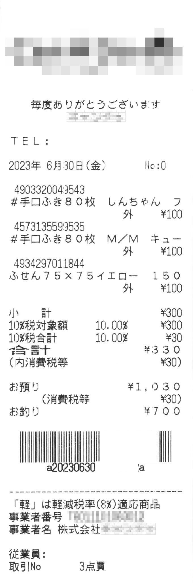

# readbarcode_x
Read barcode NW-7 on receipts

## 概要
- バーコードを含むレシートのPNG画像からバーコード部を抜き出してデコードします。
- 100均ショップのCANDOのレシートのみを対象とします。
- バーコードのフォーマットとしては NW-7 です。
- きわめて実験的なプログラムです。

## 目的
- 個人的な別の用途(会計処理ソフトへの入力テキスト生成)に利用すること
- バーコードをデコードするときにこのようにすればわりとロバストに行えるのではないか、おもしろいのではないかと
考えたことを実装して確かめること  
を目的としています。

## 注意
- 汎用的に便利に使えるコマンドを狙って作成したものではありません。
- 処理の記述はまずはわかりやすさをむねとし、多くの場所でナイーブな記述としています。
- スキャナでスキャンした画像を対象とします。カメラで撮影したものは対象外です。

## 開発・動作環境
- Windows 10 Pro
- ruby 3.2.3 (2024-01-18 revision 52bb2ac0a6) [x64-mingw-ucrt]
- Git Bash (git version 2.43.0.windows.1)

## 前提とする入力画像ファイル
- PNG format のみ
- CANDO のレシートをスキャンしたもの
- grayscale: 0..255
- 密度: TBD [DPI]
- scanner: Cannon製 TBD
  
## 前提とするバーコードフォーマット
(試したレシートがそうなっていた)
- format: NW-7
- stop/end character: 'a'
- デコード対象キャラクタ: 9bit長のもののみから構成されていること
- デジットチェック: 処理していない。デジットチェックが使用されているのか否か不明。

## 入力画像例

注意: コミットするにあたりマスク処理していますが、実使用時にはマスク処理は不要です。

## 動作例
コマンド入力
```bash
$ ./readbarcode_nw7.rb img_png_sample/Image_20230630T122723-001-mosaic.png
```
出力
```bash
a2023063020000002a
```
- 左右の 'a'(start および stop キャラクタ)が検出され、
- 2023年06月30日を示す"20230630"が正しくデコードされています。
- マスク処理した箇所はデコードできず '2', '0' になっています。
